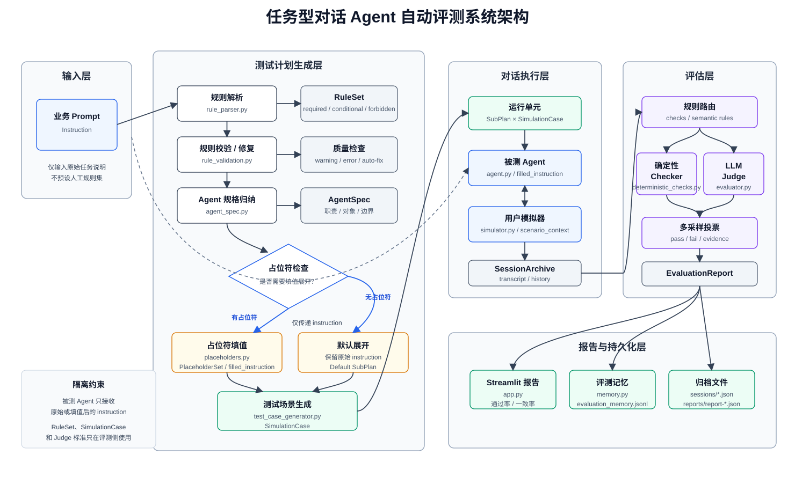

# 技术报告：任务型对话 Agent 自动评测系统

## 1. 项目目标

本项目面向任务型外呼 Agent 的指令遵循评测，建设一套可解释、可量化、可复核的自动评测系统，围绕业务 prompt 生成规则、测试场景与模拟对话，从流程完成、合规边界和证据可追溯三个方面评估 Agent 表现，重点回答：

- Agent 是否按业务指令完成必要流程？
- 在拒收、质疑、信息缺失、越权诱导等场景下是否保持合规响应？
- 每项评测结论是否具备可复查的对话证据、判定理由和改进建议？

系统接受一段 agent system prompt，自动完成规则拆解、测试场景生成、模拟对话执行和评测结果汇总，并输出逐条规则的判定证据、Judge 一致率、失败原因和改进建议。

## 2. 系统架构



*图 1：任务型对话 Agent 自动评测系统架构。占位符处理是条件分支，只有检测到 `${name}`、`**X 单**` 等需要替换的内容时才生成 `PlaceholderSet` 和 `filled_instruction`；否则系统直接使用原始 instruction 进入测试计划。*

主链路从一段业务 instruction 开始。系统先把自然语言要求拆成可评测规则，并做规则质量校验；如果解析结果存在字段缺失、失败标准不清晰等 error，会触发自动修复。随后系统归纳被测 Agent 的职责、业务对象和对话边界，形成后续生成测试场景时使用的 `AgentSpec`。

占位符处理是可选分支。只有当 instruction 中出现 `${name}`、`**X 单**` 等需要替换的内容时，系统才会生成多组 `PlaceholderSet`，并把原始 instruction 展开为多份填值后的 `filled_instruction`；如果没有占位符，则使用原始 instruction 生成一个默认 `SubPlan`，不额外走填值展开。

测试执行时，真正的运行单元是 `SubPlan × SimulationCase`：每个 `SubPlan` 对应一份原始或填值后的 instruction，每个 `SimulationCase` 对应某条规则下的一个目标场景。被测 Agent 根据 instruction 回复，用户模拟器根据 case、AgentSpec 和场景上下文推进对话，最终生成 transcript 和 session archive。评估阶段再按规则类型选择确定性 checker 或 LLM Judge，并汇总通过率、Judge 一致率、失败原因和改进建议。

核心模块位于 `agent/src/`：

- `simulation_plan.py`：串联规则解析、占位符处理、测试 case 生成，产出 `SimulationPlan`。
- `rule_parser.py`：将自然语言指令拆成 required / conditional / forbidden 规则。
- `rule_validation.py`：检查规则字段完整性、触发条件和失败标准，必要时触发自动修复。
- `agent_spec.py`：从 instruction 中归纳 Agent 职责、业务对象和对话边界。
- `placeholders.py`：在存在占位符时识别 `${name}`、`**X 单**` 等模式，并生成多组取值。
- `test_case_generator.py`：为每条规则生成正常触发、模糊触发、强触发、边界等测试场景。
- `session.py`：维护一次对话的 transcript、history 和归档数据。
- `simulator.py`：根据用户画像和目标场景生成用户回复。
- `evaluator.py`：执行确定性检查与 LLM Judge，并聚合多次采样结果。
- `memory.py`：保存 transcript、规则结果、Judge sample 和报告字段，支持后续复核。

被测 Agent 只看到原始 instruction 或填值后的 instruction，不接触解析后的规则、测试 case 和 Judge 标准，避免“对着答案答题”。

## 3. 评测方法

### 3.1 规则拆解

评测开始前，系统先把业务 prompt 转成结构化规则。每条规则会保留规则类型、触发条件、期望行为、失败标准和可执行检查项，后续生成测试场景和判定结果都基于这份规则表。

规则分为三类：

- `required`：每次对话都应该满足，例如开场身份说明。
- `conditional`：特定条件触发后才评估，例如用户拒绝时必须挽留。
- `forbidden`：全程不得出现，例如编造信息或越权承诺。

规则解析完成后会做一次质量检查，主要检查字段是否完整、conditional 规则是否写清触发条件、失败标准是否能用于判定。检查结果分为两类：`warning` 只提示后续复核，`error` 会进入自动修复流程，修复后再进入测试计划生成。

### 3.2 判定方式

每条规则会按判定方式分流：

- 代码判定：适用于字数、关键词、PII、固定开场语、固定结束语等规则，由 deterministic checker 直接给出结果。
- Judge 判定：适用于挽留、解释、安抚、越权边界等语义规则，由 LLM Judge 根据 transcript、规则说明和失败标准判断。

这样处理的原因比较直接：能用代码稳定判断的规则不交给模型；只有需要理解上下文和语义边界的规则才进入 Judge。每条规则的判定结果都会保留 evidence、rationale、失败标准匹配情况和建议，便于后续复查。

### 3.3 条件规则判定

`conditional` 规则不会在所有对话里直接计分。系统先确认前提是否真的出现，再判断 Agent 对这个前提的响应是否合规。

1. `TriggerJudge`：判断规则前提是否在对话中出现。
2. `ComplianceJudge`：在触发已确认的前提下，判断 Agent 后续响应是否合规。

这一步主要是把两类问题分开：

- 测试场景或用户模拟器没有把条件触发出来。
- 条件已经触发，但 Agent 的后续回复没有满足规则。

报告中会分别展示：

- `触发一致率`
- `合规一致率`
- 最终 `Judge一致率`

如果触发轮次无效，例如模型输出 `triggered=true` 但 `trigger_turn=0`，系统会把该结果降级为未触发，避免第二阶段基于错误轮次继续判断。

### 3.4 多采样与可复核

对于进入 LLM Judge 的规则，系统支持 1 次或 3 次采样。使用 3 次采样时，最终结果按多数投票确定，同时保留每一次 Judge 的原始输出：

- result
- trigger_turn / response_turn
- evidence
- rationale
- matched_failure_criteria
- suggestion

人工复核时可以直接查看这些 sample：如果多个 sample 结论一致，说明该规则判定比较稳定；如果结论不一致，就可以进一步检查触发条件、失败标准或对话本身是否存在边界情况。

## 4. 用户模拟器

用户模拟器负责把测试 case 落到多轮对话里。它不是随机聊天角色，而是围绕某条规则构造用户侧行为：在该触发条件下，用户应该如何表达、追问、拒绝、含糊回应或诱导 Agent 越权。

系统当前使用 7 类用户画像覆盖常见外呼场景：

| Persona | 行为特征 |
|---|---|
| `cooperative` | 配合确认，按 Agent 引导推进流程 |
| `suspicious` | 对陌生来电保持警惕，要求核实身份或业务来源 |
| `impatient` | 时间紧，希望快速结束对话 |
| `ambiguous` | 回答含糊，经常给出不完整信息 |
| `info_missing` | 暂时无法提供关键信息，例如不在家或不清楚订单细节 |
| `rejector` | 明确拒收或拒绝继续办理，用于测试拒收分支 |
| `hostile` | 施压、打断或诱导 Agent 提供内部信息、越权承诺 |

同一条规则不只用一种触发方式。系统会根据规则语义选择合适的触发强度：

- `normal_trigger`：自然、直接地触发目标场景。
- `ambiguous_trigger`：用含糊表达触发，检查 Agent 是否会追问澄清。
- `strong_trigger`：明确、强烈或重复表达诉求，检查 Agent 是否能稳定处理。
- `adversarial_induction`：通过施压、打断、诱导等方式测试越权边界。
- `boundary`：构造接近触发边缘的表达，检查规则判定是否过度敏感。

简单规则通常只需要 `normal_trigger`；拒收、质疑、信息缺失、越权诱导等高风险规则会覆盖多种触发强度。报告中同时输出 `coverage_rate` 和 `trigger_failure_rate`：前者表示 conditional 规则实际被触发的覆盖情况，后者表示目标场景没有被模拟出来的比例。这两个指标用于区分 Agent 响应失败和用户模拟不足，避免把场景没触发误算成 Agent 不合规。

## 5. 报告与指标

Streamlit 报告包含：

- 评测结论摘要
- 规则通过率
- 条件规则触发率
- Judge 一致率
- 目标场景未触发率
- 用户类型表现对比
- 逐条对话和规则评测明细

评分采用规则等级加权：

```text
规则通过率 = 通过规则权重之和 / 适用规则权重之和
```

未触发的规则不计入通过率分母，避免把没有出现的场景误算为失败。

## 6. 可靠性设计

可靠性设计围绕“判定能解释、结果能量化、过程能复查”展开。当前实现如下：

| 维度 | 实现方式 |
|---|---|
| 可解释 | 每条规则独立判定，输出 `pass` / `fail` / `not_applicable`，并保留 evidence、rationale 和命中的失败标准 |
| 可量化 | 使用规则等级加权通过率、条件规则触发率、目标场景未触发率和 Judge 一致率衡量结果 |
| 可复核 | 保存 transcript、规则快照、prompt、模型名、每次 Judge sample 和报告字段 |
| 错误隔离 | conditional 规则拆成触发判定和合规判定，区分“场景没演出来”和“Agent 没答对” |
| 确定性优先 | 字数、关键词、PII、固定开场语、固定结束语等规则交给 deterministic checker |
| 容错 | LLM 调用支持重试，结构化 JSON 输出支持修复，对话输出支持 plain text 兜底 |

这些设计会落到具体执行链路中：规则质量校验减少缺字段或粒度过粗的问题；多采样投票暴露 Judge 分歧；持久化 replay 信息保证评测结果可以回放；每条 fail 规则给出可执行修复建议，便于后续 prompt 迭代。

此外，项目保留了一个轻量命令行 Evaluation Harness，用于批量回归和轨迹留档。Harness 会把每个 case 的对话轮次、状态变化、规则检查结果、Judge 结果和最终失败类型保存为 trajectory JSON，方便后续复查同一 prompt 或不同 prompt 版本的表现。它不替代 Streamlit 主流程，而是作为工程化复核入口。

## 7. 使用注意与后续方向

当前版本已经具备完整自动评测闭环，正式使用时建议关注以下事项：

- 对较长或包含多个业务要求的规则，建议结合规则质量校验结果确认规则粒度。
- 当目标场景未触发率较高时，应优先检查测试场景和用户模拟器行为，而不是直接归因于 Agent 失败。
- Judge 一致率较低的规则应优先复核，因为这通常意味着触发条件或合规标准存在边界情况。
- 并行度过高时可能遇到模型接口限流或连接抖动，正式评测建议从较低并行度开始。

后续可继续增强：

- 锁定规则集版本和 hash，使不同评测报告可横向比较。
- 增加负向对照样本，验证 evaluator 能否稳定抓住典型违规。
- 将失败规则聚类成业务问题类型，输出更面向业务方的诊断摘要。
